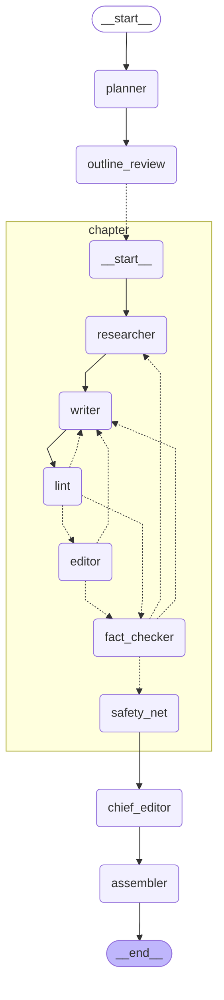

# Pay Me on UPI: a multi-agent book writer

[](https://github.com/shikharsumantech14/book-writer/actions/workflows/ci.yml)

Take-home assignment for the Patel Group AI Engineer role. Six agents (Planner, Researcher, Writer, Editor,
Fact-checker and Chief Editor) research and write *Pay Me on UPI: How Digital Payments Changed Small Business
in India*, a three-chapter book for first-time shop owners. Every fact, figure and date carries a numbered
citation to a real page that the system read and verified itself.

**Read the book:** [docs/sample-output/book.md](docs/sample-output/book.md) (or the
[HTML version](docs/sample-output/book.html)). It comes from one full run on the `showcase` profile: 2,501 words,
16 references, 29 of 29 checked claims supported by their sources, every link working, and the system's own
scorecard passed. Chapters 2 and 3 carry one warning each: the Editor's last style notes were not applied,
because its send-back budget ran out. The run's [event log](docs/sample-output/events.jsonl) and
[report](docs/sample-output/run_report.json) are committed next to it.

**Status:** the agent engine, CLI, research MCP server, HTTP API with live streaming and tests are done
(milestones M1 and M2). The live dashboard comes next. The full design, milestones and cost plan are in
[docs/PLAN.md](docs/PLAN.md).

## Quick start

You need [uv](https://docs.astral.sh/uv/), an Anthropic API key and a free [Tavily](https://tavily.com) key.

```bash
git clone https://github.com/shikharsumantech14/book-writer.git
cd book-writer/backend
uv sync
cp .env.example .env    # then add ANTHROPIC_API_KEY and TAVILY_API_KEY
uv run bookwriter run --profile dev --chapters 1
```

That last command researches and writes one chapter on the `dev` profile (about $0.60) and streams every
agent step to the terminal. Leave out `--chapters 1` for the whole book, and use `--profile showcase` for the
designed model routing. Each run writes to `backend/data/runs/<run_id>/`:

| File | Contents |
|---|---|
| `book.md`, `book.html` | The book, with a reference list after each chapter |
| `events.jsonl` | Every agent step, tool call and model call, in order |
| `run_report.json` | Status, cost per agent, model and chapter, and the scorecard |

Other commands, none of which call a model:

| Command | What it does |
|---|---|
| `uv run bookwriter report <run_id>` | Cost table and scorecard of a finished run |
| `uv run bookwriter replay <run_id> --speed 20` | Replays a recorded run in the terminal with its original pacing |
| `uv run bookwriter serve` | Starts the HTTP API; interactive docs at http://localhost:8000/docs |
| `uv run bookwriter graph` | Prints the agent graph as Mermaid |
| `uv run pytest` | Runs the tests |

The committed sample run works with all of them, e.g. `uv run bookwriter replay ../docs/sample-output/events.jsonl`.

## How it works

The agents never talk to each other directly. Each one reads and writes typed fields on a shared state
(Pydantic models), and plain Python routers decide where the work goes next. Every review loop has a budget,
so a run always ends.

| Agent | Job | `showcase` model · effort | `dev` model · effort |
|---|---|---|---|
| Planner | Outline, fact questions per chapter, style guide and glossary | Opus 5.5 · high | Sonnet 5.5 · medium |
| Researcher | Tool loop over MCP: search, read pages, record quotes it verified | Sonnet 5.5 · medium | Sonnet 5.5 · low |
| Writer | Writes from the evidence pack; sees ids and quotes, never URLs | Opus 5.5 · medium, high on rewrites | Sonnet 5.5 · low, medium on rewrites |
| Lint (code) | Word count, prose only, citation format, every figure cited, takeaway line | | |
| Editor | Tone, clarity, jargon and grammar, with must-fix and polish issues | Sonnet 5.5 · medium | Sonnet 5.5 · low |
| Claim tagger | Flags factual sentences that lack a citation | Haiku 4.5 | Haiku 4.5 |
| Fact-checker | Checks links, then whether each cited quote supports its sentence | Opus 5.5 · high | Sonnet 5.5 · medium |
| Safety net (code) | Removes any sentence still unverified when the budgets run out | | |
| Chief Editor | One consistent voice across chapters, through guarded find-and-replace edits | Opus 5.5 · high | Sonnet 5.5 · medium |
| Assembler (code) | Numbers citations `[1]..[n]` per chapter and builds the reference lists | | |

Judgement the grade depends on (planning, prose, deciding whether a claim is supported) runs on the strongest
model. The tool-heavy research loop and the editorial review run one tier down, and pure classification runs
on the fastest. Routing, effort, prices and loop budgets all live in
[`backend/config.yaml`](backend/config.yaml).

### Agent graph

The planner fans out one chapter subgraph per chapter, run in parallel. Dotted arrows are router decisions.
`outline_review` is human in the loop: when a run asks for it, the graph pauses after the Planner until a
person approves, edits or rejects the outline, then continues from its checkpoint.
This diagram is generated from the compiled LangGraph graph (`uv run bookwriter graph`), and CI fails if it
drifts from the code.

<!-- agent-graph:start -->

<!-- agent-graph:end -->

### Loop budgets

| Loop | Budget | When it runs out |
|---|---|---|
| Lint → Writer | 3 in a row | Go on; the remaining issues ride along with the next reviewer's feedback |
| Editor → Writer | 2 send-backs | Go to the Fact-checker; the chapter is marked "not approved" |
| Fact-checker → Writer or Researcher | 2 send-backs | The safety net removes whatever is still unverified |
| Writer passes per chapter | 7 | No more rewrites: one last fact-check, then the safety net |
| Researcher tool calls | 40, plus 15 per gap round | The Writer works with what was found |

## Citation integrity

1. **Search** goes through Tavily, official sources first (NPCI, RBI, PIB, ministries), then reputable news.
2. **Pages are fetched and read in code**: HTML via trafilatura, PDF via pypdf. Tavily Extract is the
   fallback for JavaScript-only pages and for sites that block automated clients (HTTP 403, 406, 429).
3. **Every quote is verified in code** against the page text before it can be saved. The quote must appear
   verbatim, apart from punctuation and spacing, and a claim may not state a number its quote doesn't contain.
4. **The Writer cites evidence ids, not URLs**, so it cannot invent or garble a link. Links enter the book
   only through the Assembler, from verified evidence.
5. **The Fact-checker** re-checks every link, then judges each cited sentence against its quote and the
   surrounding page text. A fast model flags factual sentences that carry no citation.
6. **The safety net** removes any sentence still unsupported, partly supported, or stating an uncited figure.
   The report lists every removal.

## Cost and tokens

Every model call is metered: tokens by kind (input, output, cache read, cache write), priced from
`config.yaml`. An unknown model ID fails loudly instead of counting as $0, and each run has a cost cap
(`--max-cost`, default $5).

Measured, not estimated. The [sample book](docs/sample-output/run_report.json) cost **$2.93** on the
`showcase` profile, taking 8 minutes. The same three-chapter book on the `dev` profile cost $1.61 and took 5 minutes:

| Agent | `showcase` calls | `showcase` cost | `dev` cost |
|---|---:|---:|---:|
| Writer | 16 | $1.40 | $0.50 |
| Researcher | 30 | $0.65 | $0.62 |
| Fact-checker | 7 | $0.34 | $0.18 |
| Editor | 9 | $0.22 | $0.19 |
| Planner | 1 | $0.17 | $0.05 |
| Chief Editor | 1 | $0.09 | $0.02 |
| Claim tagger | 7 | $0.05 | $0.05 |
| **Total** | 71 | **$2.93** | **$1.61** |

Almost half the `showcase` cost is the Writer, the role whose output is graded directly; the rest of the
Opus-for-judgement routing added about $0.40 over `dev`. Two-thirds of all prompt tokens were cheap cache
reads: the Researcher's growing tool-loop history is cached, so each turn re-reads it at a fraction of the
input price. Building and debugging the pipeline took four `dev` runs ($3.42 in total) before this one.

How the system keeps tokens down: right-sized models per role, with effort set explicitly; code checks before
any LLM review; compact tool outputs (top-ranked passages, not whole pages); the Writer sees only ids, claims and
quotes; one batched fact-check call per chapter; a disk cache so re-runs don't refetch pages.

Building the project with Claude Code is measured too: [docs/DEV_COST.md](docs/DEV_COST.md), generated from
the session transcripts by [`scripts/dev_usage.py`](scripts/dev_usage.py).

## HTTP API

`uv run bookwriter serve` starts a FastAPI service for the dashboard. A run started through the API runs in the
background, and its events stream live as Server-Sent Events.

| Endpoint | Purpose |
|---|---|
| `POST /runs` | Start a run: profile, chapters, cost cap, human review, brief and budget overrides |
| `GET /runs` · `GET /runs/{id}` | Run history; status, cost so far, scorecard, the outline awaiting review |
| `GET /runs/{id}/events` | Live event stream (SSE), resumable from any event: `?after=N` or `Last-Event-ID` |
| `POST /runs/{id}/resume` | Approve, edit or reject the outline of a run waiting for review |
| `POST /runs/{id}/cancel` | Stop a run; its report is still written |
| `GET /runs/{id}/book.md`, `book.html`, `report` | The outputs |
| `GET /graph` | Agent graph nodes and edges, exported from LangGraph, plus the Mermaid source |
| `GET /config` · `GET /estimate` | Brief, routing per profile and prices; pre-run cost estimate from measured runs |

Finished runs stream from their recording, and `?speed=N` replays them with their original pacing, N times
faster. The dashboard can therefore be built and demonstrated against recorded runs, including the committed
sample, without spending anything. One run at a time: a second `POST /runs` while one is going returns 409.

## Use the research tools from Claude (MCP)

The Researcher and Fact-checker reach the web through an MCP server
([`mcp_servers/research.py`](backend/src/bookwriter/mcp_servers/research.py)) with four tools: `web_search`,
`read_page`, `verify_quote` and `check_links`. Any MCP host can use it. For Claude Desktop, add this to
`claude_desktop_config.json`:

```json
{
  "mcpServers": {
    "bookwriter-research": {
      "command": "uv",
      "args": ["run", "--directory", "/path/to/book-writer/backend", "bookwriter", "mcp", "research"]
    }
  }
}
```

For Claude Code:

```bash
claude mcp add bookwriter-research -- uv run --directory /path/to/book-writer/backend bookwriter mcp research
```

## Project layout

```
backend/
  config.yaml            the brief, models and prices, routing profiles, loop budgets, source lists
  src/bookwriter/
    graph.py             book graph and chapter subgraph (LangGraph)
    routers.py           where work goes next, and every stop condition
    agents/              planner, researcher, writer, editor, fact_checker, chief_editor
    prompts/             one Markdown prompt per agent
    checks/              lint and the safety net (code, no LLM)
    tools/web.py         search, fetch with fallback, quote verification, link checks
    mcp_servers/         the research MCP server
    llm.py, pricing.py   the one place that calls Claude; token and cost accounting
    runner.py, cli.py    run a book and record it; the bookwriter command
    api/                 FastAPI service: runs, live event stream, outline review
    store.py             reads run folders back (runs are folders, not database rows)
    scorecard.py         grades a book against the brief
    estimate.py          pre-run cost estimate from measured runs
  tests/                 unit tests and a fake-LLM end-to-end run (no API cost)
docs/
  PLAN.md                the approved design and milestones
  DEV_COST.md            tokens spent building the project
  sample-output/         the sample book, its event log and its run report
scripts/dev_usage.py     generates DEV_COST.md
```

## Development

```bash
cd backend
uv run pytest
uv run ruff check src tests ../scripts
```

The end-to-end test runs the whole graph with a scripted fake Claude client and canned web pages, driving
every send-back loop at least once at no API cost. CI runs lint, the tests and the scorecard on the committed
sample book on every push.
