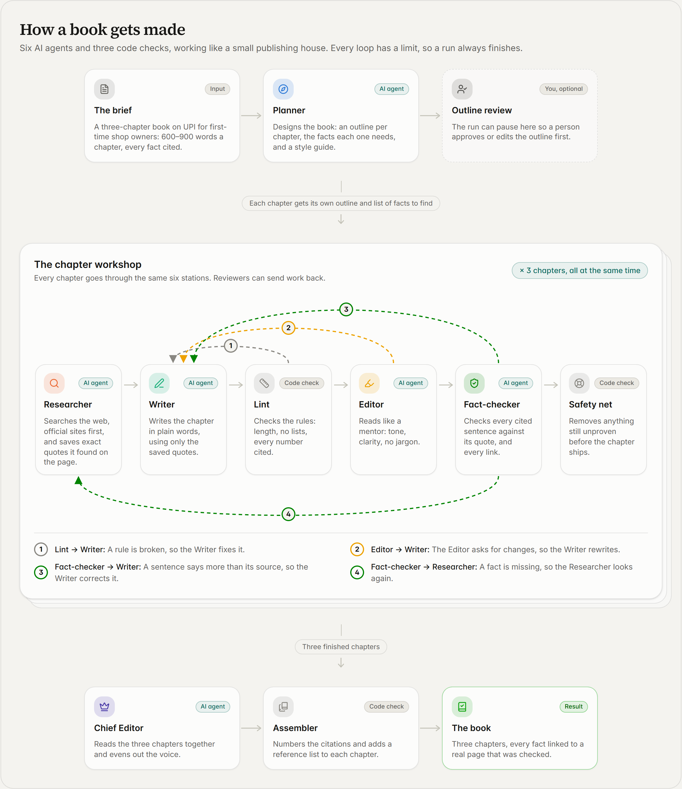
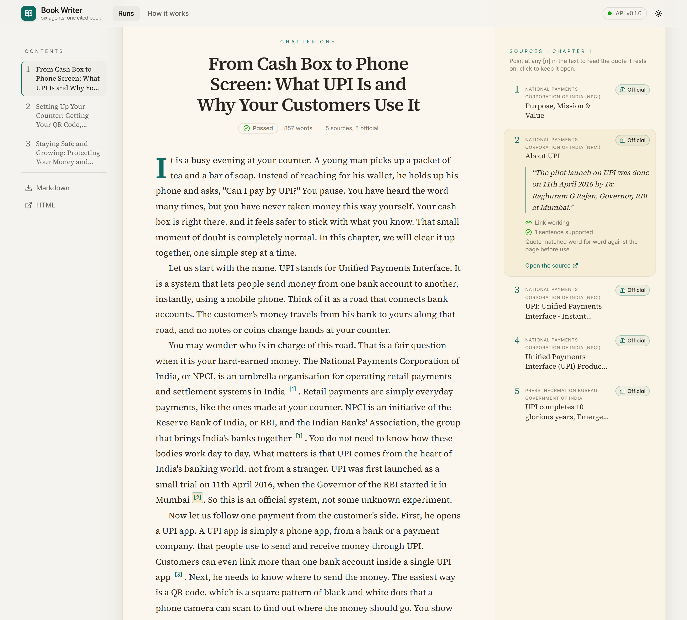
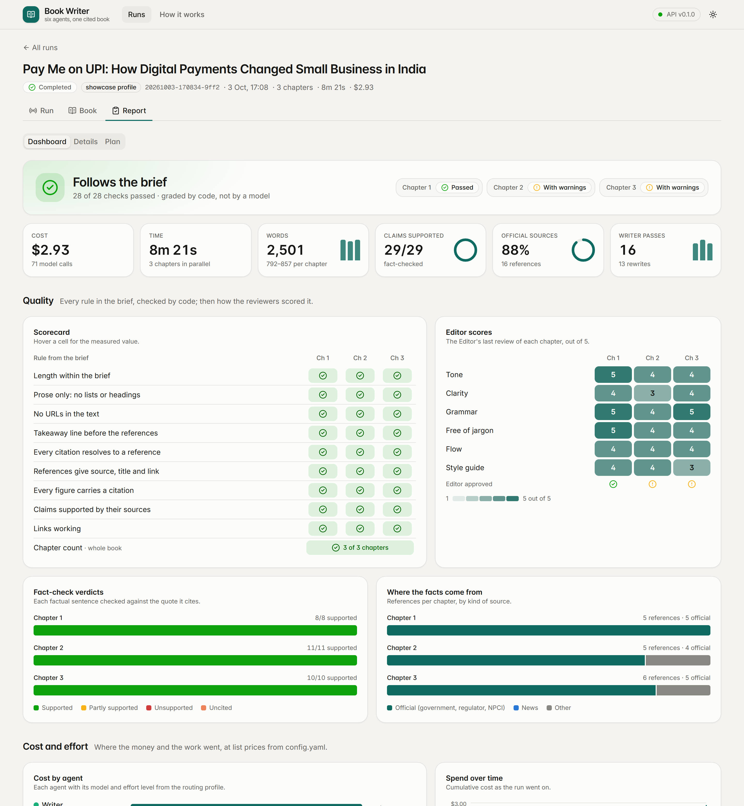
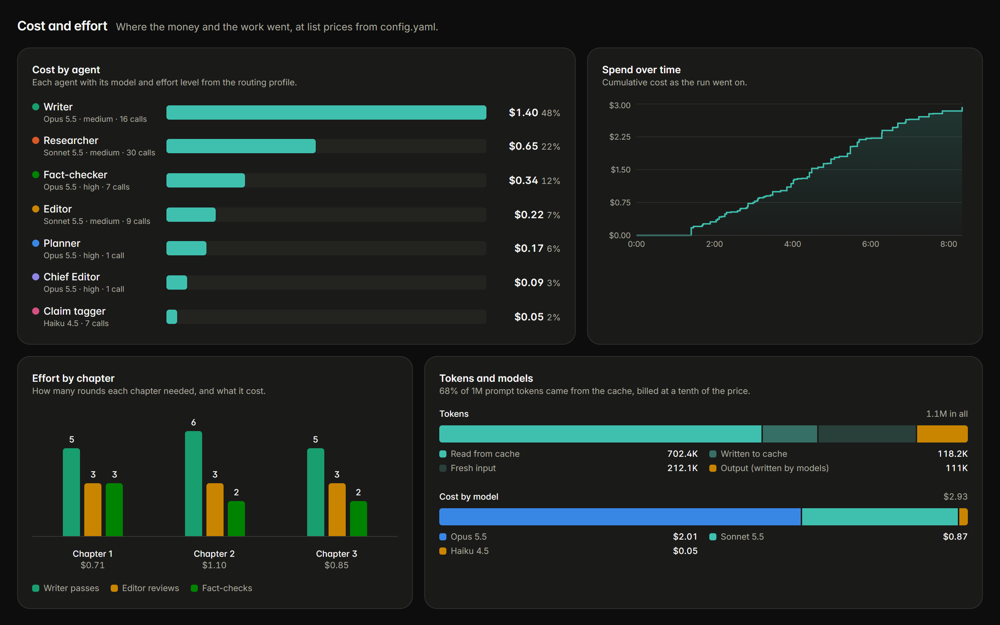
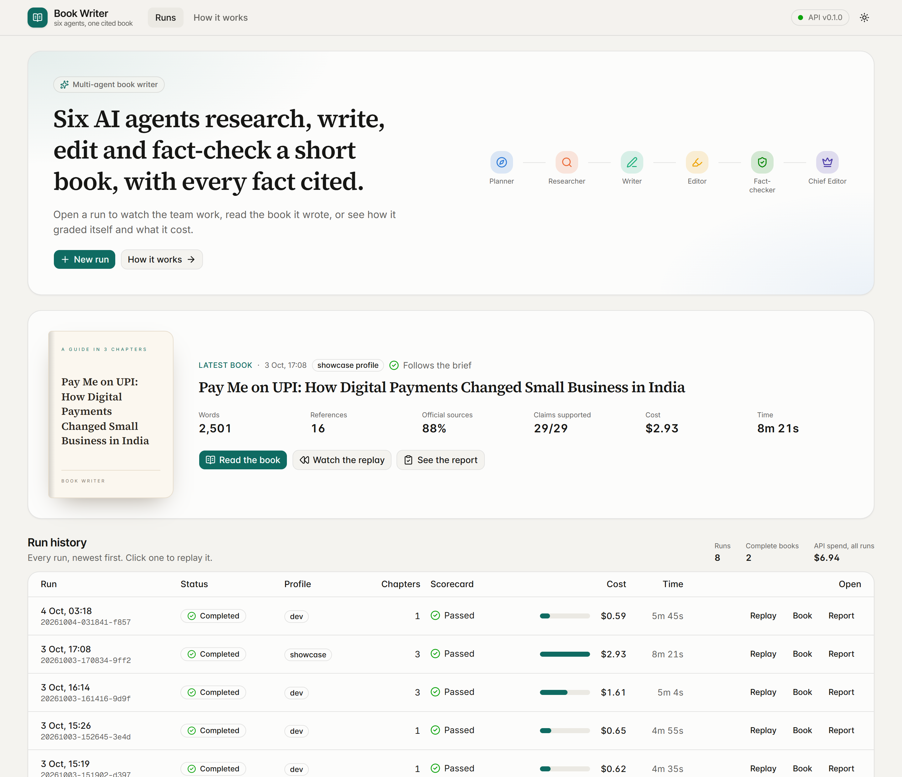
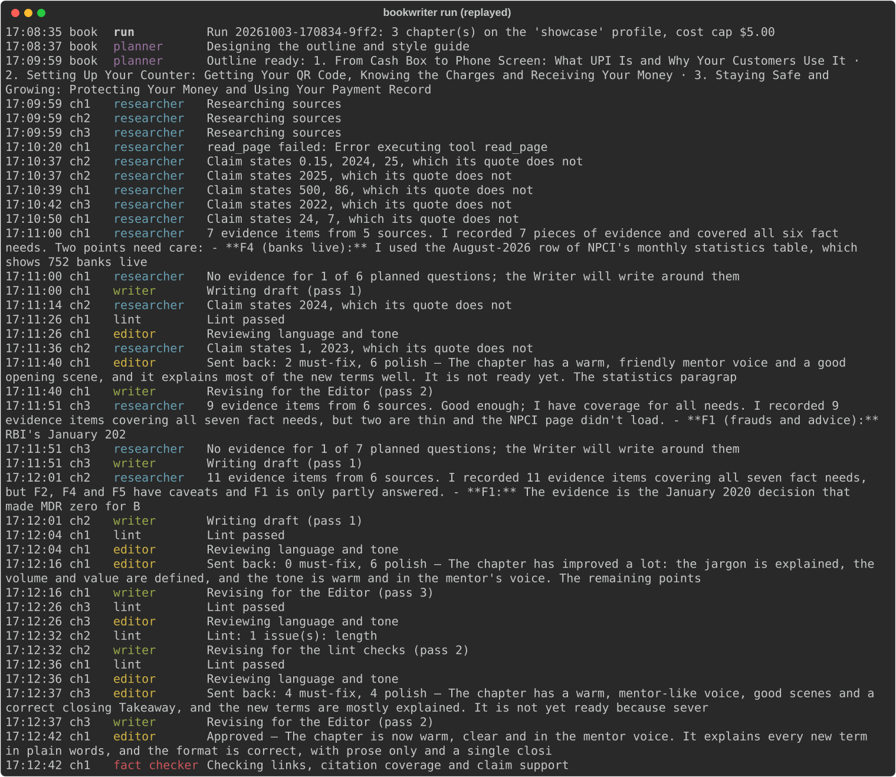
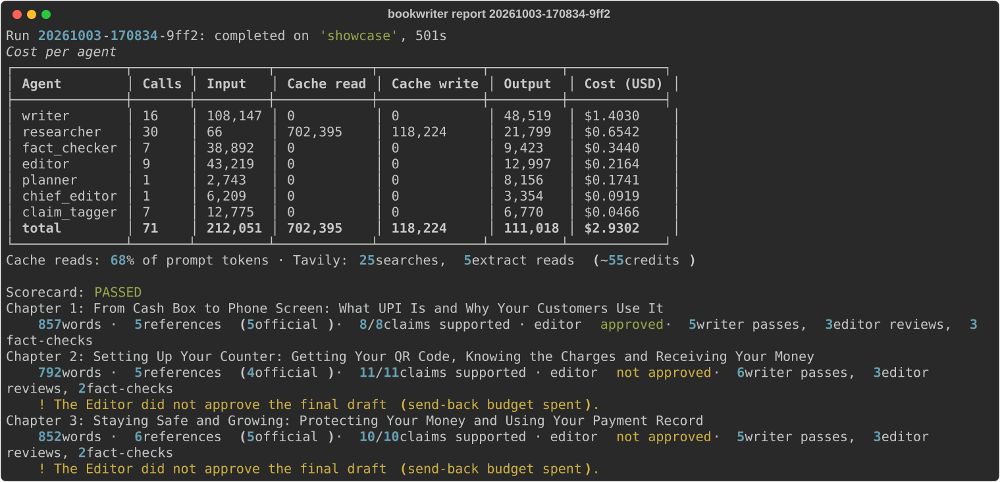

# Pay Me on UPI: a multi-agent book writer

[](https://github.com/shikharsumantech14/book-writer/actions/workflows/ci.yml)

**What is this?** A team of AI agents that writes a short book on its own, with every fact cited. You give it a
brief: a topic, a reader and a length. It plans the chapters, searches the web for facts, writes, and then reviews
its own work the way an editor and a fact-checker would, sending chapters back until they pass. Every fact in the
finished book links to the web page it came from, and the system read that page and checked the quote itself.

It was built as the take-home assignment for the Patel Group AI Engineer role. The brief asks for a three-chapter
book for first-time shop owners: *Pay Me on UPI: How Digital Payments Changed Small Business in India*.

**Read the book it wrote:** [docs/sample-output/book.md](docs/sample-output/book.md) (or the
[HTML version](docs/sample-output/book.html)). It comes from one full run on the `showcase` profile: 2,501 words,
16 references, 29 of 29 checked claims supported by their sources, every link working, and the system's own
scorecard passed. Chapters 2 and 3 carry one warning each: the Editor's last style notes were not applied,
because its send-back budget ran out. The run's [event log](docs/sample-output/events.jsonl) and
[report](docs/sample-output/run_report.json) are committed next to it.

<picture>
  <source media="(prefers-color-scheme: dark)" srcset="docs/how-it-works-dark.png">
  
</picture>

**Status:** complete: agent engine, CLI, research MCP server, HTTP API with live streaming, dashboard, tests and
CI (milestones M1 to M4), then a redesign of the dashboard and these pictures (M6). The design, milestones and cost
plan are in [docs/PLAN.md](docs/PLAN.md); the architecture is in [docs/architecture.md](docs/architecture.md).

## See it work


The **Run** page streams a run live, or replays a recorded one: each chapter moves along its lane, the station at
work glows, and every time a reviewer sends work back a loop is drawn and counted.

| **Book:** point at any [n] and its source opens in the margin, with the quote checked on that page | **Report:** the verdict, the key numbers, every rule of the brief per chapter, and the Editor's scores |
|---|---|
|  |  |
| **Report, cost and effort:** cost per agent with its model, spend over time, rounds per chapter, tokens | **Runs:** the latest book and every run with its cost |
|  |  |

<details>
<summary>The same run in the terminal</summary>




</details>

## Quick start

You need [uv](https://docs.astral.sh/uv/), an Anthropic API key and a free [Tavily](https://tavily.com) key.

```bash
git clone https://github.com/shikharsumantech14/book-writer.git
cd book-writer/backend
uv sync
cp .env.example .env    # then add ANTHROPIC_API_KEY and TAVILY_API_KEY
uv run bookwriter run --profile dev --chapters 1
```

That last command researches and writes one chapter on the `dev` profile (about $0.60) and streams every
agent step to the terminal. Leave out `--chapters 1` for the whole book, and use `--profile showcase` for the
designed model routing. Each run writes to `backend/data/runs/<run_id>/`:

| File | Contents |
|---|---|
| `book.md`, `book.html` | The book, with a reference list after each chapter |
| `events.jsonl` | Every agent step, tool call and model call, in order |
| `run_report.json` | Status, cost per agent, model and chapter, and the scorecard |

Other commands, none of which call a model:

| Command | What it does |
|---|---|
| `uv run bookwriter report <run_id>` | Cost table and scorecard of a finished run |
| `uv run bookwriter replay <run_id> --speed 20 --quiet` | Replays a recorded run in the terminal with its original pacing |
| `uv run bookwriter serve` | Starts the HTTP API; interactive docs at http://localhost:8000/docs |
| `uv run bookwriter graph` | Prints the agent graph as Mermaid |
| `uv run pytest` | Runs the tests |

The committed sample run works with all of them, e.g. `uv run bookwriter replay ../docs/sample-output/events.jsonl`.

To open the dashboard, start the API, then the Next.js app in a second terminal (needs Node 20+):

```bash
uv run bookwriter serve
```

```bash
cd frontend && npm install && npm run dev
```

Then open http://localhost:3000. The committed sample run is listed, so the dashboard can be explored, and its
run replayed, without any API key.

## How it works

<picture>
  <source media="(prefers-color-scheme: dark)" srcset="docs/architecture-dark.png">
  
</picture>

The agents never talk to each other directly. Each one reads and writes typed fields on a shared state
(Pydantic models), and plain Python routers decide where the work goes next. Every review loop has a budget,
so a run always ends.

| Agent | Job | `showcase` model · effort | `dev` model · effort |
|---|---|---|---|
| Planner | Outline, fact questions per chapter, style guide and glossary | Opus 5.5 · high | Sonnet 5.5 · medium |
| Researcher | Tool loop over MCP: search, read pages, record quotes it verified | Sonnet 5.5 · medium | Sonnet 5.5 · low |
| Writer | Writes from the evidence pack; sees ids and quotes, never URLs | Opus 5.5 · medium, high on rewrites | Sonnet 5.5 · low, medium on rewrites |
| Lint (code) | Word count, prose only, citation format, every figure cited, takeaway line | | |
| Editor | Tone, clarity, jargon and grammar, with must-fix and polish issues | Sonnet 5.5 · medium | Sonnet 5.5 · low |
| Claim tagger | Flags factual sentences that lack a citation | Haiku 4.5 | Haiku 4.5 |
| Fact-checker | Checks links, then whether each cited quote supports its sentence | Opus 5.5 · high | Sonnet 5.5 · medium |
| Safety net (code) | Removes any sentence still unverified when the budgets run out | | |
| Chief Editor | One consistent voice across chapters, through guarded find-and-replace edits | Opus 5.5 · high | Sonnet 5.5 · medium |
| Assembler (code) | Numbers citations `[1]..[n]` per chapter and builds the reference lists | | |

Judgement the grade depends on (planning, prose, deciding whether a claim is supported) runs on the strongest
model. The tool-heavy research loop and the editorial review run one tier down, and pure classification runs
on the fastest. Routing, effort, prices and loop budgets all live in
[`backend/config.yaml`](backend/config.yaml).

### Agent graph

The chapter workshop in the picture at the top is the real graph: the Planner fans out one chapter subgraph per
chapter, run in parallel, and plain-Python routers decide every send-back. `outline_review` is human in the loop:
when a run asks for it, the graph pauses after the Planner until a person approves, edits or rejects the outline,
then continues from its checkpoint. The exact graph, generated from the compiled LangGraph graph
(`uv run bookwriter graph`), is in [docs/architecture.md](docs/architecture.md#agent-graph); CI fails if it drifts
from the code.

### Loop budgets

| Loop | Budget | When it runs out |
|---|---|---|
| Lint → Writer | 3 in a row | Go on; the remaining issues ride along with the next reviewer's feedback |
| Editor → Writer | 2 send-backs | Go to the Fact-checker; the chapter is marked "not approved" |
| Fact-checker → Writer or Researcher | 2 send-backs | The safety net removes whatever is still unverified |
| Writer passes per chapter | 7 | No more rewrites: one last fact-check, then the safety net |
| Researcher tool calls | 40, plus 15 per gap round | The Writer works with what was found |

## Citation integrity

1. **Search** goes through Tavily, official sources first (NPCI, RBI, PIB, ministries), then reputable news.
2. **Pages are fetched and read in code**: HTML via trafilatura, PDF via pypdf. Tavily Extract is the
   fallback for JavaScript-only pages and for sites that block automated clients (HTTP 403, 406, 429).
3. **Every quote is verified in code** against the page text before it can be saved. The quote must appear
   verbatim, apart from punctuation and spacing, and a claim may not state a number its quote doesn't contain.
4. **The Writer cites evidence ids, not URLs**, so it cannot invent or garble a link. Links enter the book
   only through the Assembler, from verified evidence.
5. **The Fact-checker** re-checks every link, then judges each cited sentence against its quote and the
   surrounding page text. A fast model flags factual sentences that carry no citation.
6. **The safety net** removes any sentence still unsupported, partly supported, or stating an uncited figure.
   The report lists every removal.

## Cost and tokens

Every model call is metered: tokens by kind (input, output, cache read, cache write), priced from
`config.yaml`. An unknown model ID fails loudly instead of counting as $0, and each run has a cost cap
(`--max-cost`, default $5).

Measured, not estimated. The [sample book](docs/sample-output/run_report.json) cost **$2.93** on the
`showcase` profile, taking 8 minutes. The same three-chapter book on the `dev` profile cost $1.61 and took 5 minutes:

| Agent | `showcase` calls | `showcase` cost | `dev` cost |
|---|---:|---:|---:|
| Writer | 16 | $1.40 | $0.50 |
| Researcher | 30 | $0.65 | $0.62 |
| Fact-checker | 7 | $0.34 | $0.18 |
| Editor | 9 | $0.22 | $0.19 |
| Planner | 1 | $0.17 | $0.05 |
| Chief Editor | 1 | $0.09 | $0.02 |
| Claim tagger | 7 | $0.05 | $0.05 |
| **Total** | 71 | **$2.93** | **$1.61** |

Almost half the `showcase` cost is the Writer, the role whose output is graded directly; the rest of the
Opus-for-judgement routing added about $0.40 over `dev`. Two-thirds of all prompt tokens were cheap cache
reads: the Researcher's growing tool-loop history is cached, so each turn re-reads it at a fraction of the
input price. Building and debugging the pipeline took four `dev` runs ($3.42 in total) before this one.

How the system keeps tokens down: right-sized models per role, with effort set explicitly; code checks before
any LLM review; compact tool outputs (top-ranked passages, not whole pages); the Writer sees only ids, claims and
quotes; one batched fact-check call per chapter; a disk cache so re-runs don't refetch pages.

Building the project with Claude Code is measured too: [docs/DEV_COST.md](docs/DEV_COST.md), generated from
the session transcripts by [`scripts/dev_usage.py`](scripts/dev_usage.py).

## HTTP API

`uv run bookwriter serve` starts a FastAPI service for the dashboard. A run started through the API runs in the
background, and its events stream live as Server-Sent Events.

| Endpoint | Purpose |
|---|---|
| `POST /runs` | Start a run: profile, chapters, cost cap, human review, brief and budget overrides |
| `GET /runs` · `GET /runs/{id}` | Run history; status, cost so far, scorecard, the outline awaiting review |
| `GET /runs/{id}/events` | Live event stream (SSE), resumable from any event: `?after=N` or `Last-Event-ID` |
| `POST /runs/{id}/resume` | Approve, edit or reject the outline of a run waiting for review |
| `POST /runs/{id}/cancel` | Stop a run; its report is still written |
| `GET /runs/{id}/book.md`, `book.html`, `report` | The outputs |
| `GET /graph` | Agent graph nodes and edges, exported from LangGraph, plus the Mermaid source |
| `GET /config` · `GET /estimate` | Brief, routing per profile and prices; pre-run cost estimate from measured runs |

Finished runs stream from their recording, and `?speed=N` replays them with their original pacing, N times
faster. The dashboard can therefore be built and demonstrated against recorded runs, including the committed
sample, without spending anything. One run at a time: a second `POST /runs` while one is going returns 409.

## Dashboard

A Next.js + shadcn/ui app in [`frontend/`](frontend/) that reads everything from the API. Each page has the
character of its job, and each agent keeps one colour and one icon everywhere
([design system](frontend/DESIGN.md)).

| Page | What it shows |
|---|---|
| Runs | What the product is in one line, the latest book as a cover with its numbers, and every run with its status, scorecard, cost and time. New run starts one, with the model routing per agent and a cost estimate from measured runs |
| Run | A mission-control console, live or replayed: spend against the cost cap, model calls, tokens and progress; the assembly line, one lane per chapter, where the station at work glows and every send-back draws a counted loop back to the Writer or the Researcher; a timeline of who worked when; a feed filterable by chapter. The outline review dialog appears here when a run waits for it |
| Book | The book as a printed page: a title page, chapter openers with a drop cap, the takeaway as a pull quote. Point at any `[n]` and its source opens in the margin, with the quote verified on that page, the link status and the Fact-checker's verdict, without covering the text |
| Report | A data dashboard: the verdict and key numbers; every rule of the brief per chapter; the Editor's scores as a heatmap; fact-check verdicts and source mix per chapter; cost per agent and model, spend over time, rounds per chapter and the token mix. The chapter details, usage tables and the Planner's outline are in two more tabs |
| How it works | The two pictures in this README. The dashboard draws them, so they always look like the product |

## Use the research tools from Claude (MCP)

The Researcher and Fact-checker reach the web through an MCP server
([`mcp_servers/research.py`](backend/src/bookwriter/mcp_servers/research.py)) with four tools: `web_search`,
`read_page`, `verify_quote` and `check_links`. Any MCP host can use it. For Claude Desktop, add this to
`claude_desktop_config.json`:

```json
{
  "mcpServers": {
    "bookwriter-research": {
      "command": "uv",
      "args": ["run", "--directory", "/path/to/book-writer/backend", "bookwriter", "mcp", "research"]
    }
  }
}
```

For Claude Code:

```bash
claude mcp add bookwriter-research -- uv run --directory /path/to/book-writer/backend bookwriter mcp research
```

## Project layout

```
backend/
  config.yaml            the brief, models and prices, routing profiles, loop budgets, source lists
  src/bookwriter/
    graph.py             book graph and chapter subgraph (LangGraph)
    routers.py           where work goes next, and every stop condition
    agents/              planner, researcher, writer, editor, fact_checker, chief_editor
    prompts/             one Markdown prompt per agent
    checks/              lint and the safety net (code, no LLM)
    tools/web.py         search, fetch with fallback, quote verification, link checks
    mcp_servers/         the research MCP server
    llm.py, pricing.py   the one place that calls Claude; token and cost accounting
    runner.py, cli.py    run a book and record it; the bookwriter command
    api/                 FastAPI service: runs, live event stream, outline review
    store.py             reads run folders back (runs are folders, not database rows)
    scorecard.py         grades a book against the brief
    estimate.py          pre-run cost estimate from measured runs
  tests/                 unit tests and a fake-LLM end-to-end run (no API cost)
frontend/                Next.js dashboard (DESIGN.md: the design system)
  src/app/               routes: runs, run (live/replay), book, report, explain
  src/components/        assembly line, timeline and feed; book reader; report dashboard; the explain pictures
  src/lib/               API types, agent identities, the event-stream reducer, the timeline builder
docs/
  PLAN.md                the approved design and milestones
  architecture.md        system diagram and the agent graph generated from code
  how-it-works*.png,     the README pictures, drawn by the dashboard's /explain page
  architecture*.png
  screenshots/           the dashboard and the terminal, from the sample run
  DEV_COST.md            tokens spent building the project
  sample-output/         the sample book, its event log and its run report
scripts/dev_usage.py     generates DEV_COST.md
```

## How it was built

- **Plan first.** [docs/PLAN.md](docs/PLAN.md) was written and reviewed before any engine code: a second model
  reviewed the first draft (section 0 records what changed and why), and the plan was approved before code was
  written. Deviations are recorded in its status section.
- **Milestones as commits.** Engine (M1), first push (M1.5), service (M2), dashboard (M3), polish (M4) and
  redesign (M6), each a run of small conventional commits, tagged `m1-engine` to `m6-redesign`. The pushed state
  passed CI at every step.
- **Cheap runs first.** Every paid run was approved in advance and capped. Three single-chapter `dev` runs and
  one full `dev` book ($3.42 together) found the real bugs before the one `showcase` run ($2.93): a lint rule
  that read "UPI123Pay" as an uncited figure, a sentence splitter that broke on "Dr.", evidence claims that said
  more than their quotes, a Fact-checker stricter than its own instructions, Editor rules that contradicted the
  Writer's, and a truncated PDF that crashed page reading. Each fix came with a test. One more single-chapter run
  ($0.59) tested outline review end to end. Total API spend for the whole project: $6.94.
- **A second design pass.** The first dashboard worked but looked like a component kit, and the README diagrams
  were plain Mermaid. M6 gave each page the character of its job (a console for the run, a printed page for the
  book, a data dashboard for the report) and replaced the diagrams with pictures the dashboard draws. It was
  planned and approved first ([PLAN.md section 18](docs/PLAN.md)), then built and checked against recorded runs,
  at no API cost.
- **Measured development cost.** Building this with Claude Code used about $85 of model time at API list prices
  (it ran on a subscription, so nothing was charged per token); 99% of those tokens were cheap cache reads.
  Broken down by session and model in [docs/DEV_COST.md](docs/DEV_COST.md), generated from the session
  transcripts.

## Development

```bash
cd backend && uv run pytest && uv run ruff check src tests ../scripts
```

```bash
cd frontend && npm test && npm run lint && npm run typecheck
```

The backend's end-to-end test runs the whole graph with a scripted fake Claude client and canned web pages,
driving every send-back loop at least once at no API cost; other tests cover lint, routers and stop conditions,
quote verification, the fetch fallback, the MCP server, the API (including outline review and cancellation),
the committed sample book and the generated diagrams. The dashboard's tests hold its event reducer and its
timeline builder to the backend's report on the sample run. CI runs all of it, plus a production build of the
dashboard, on every push.
