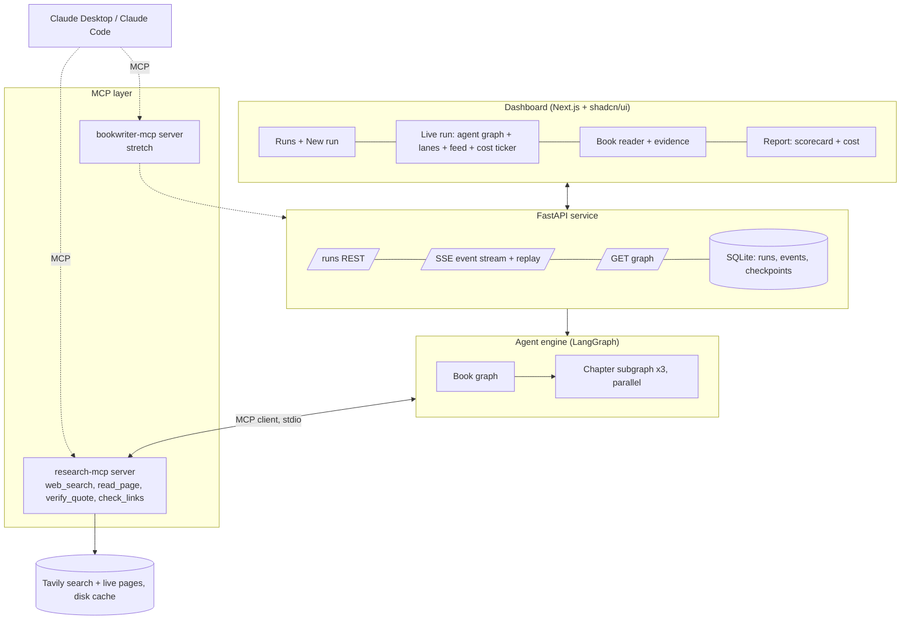
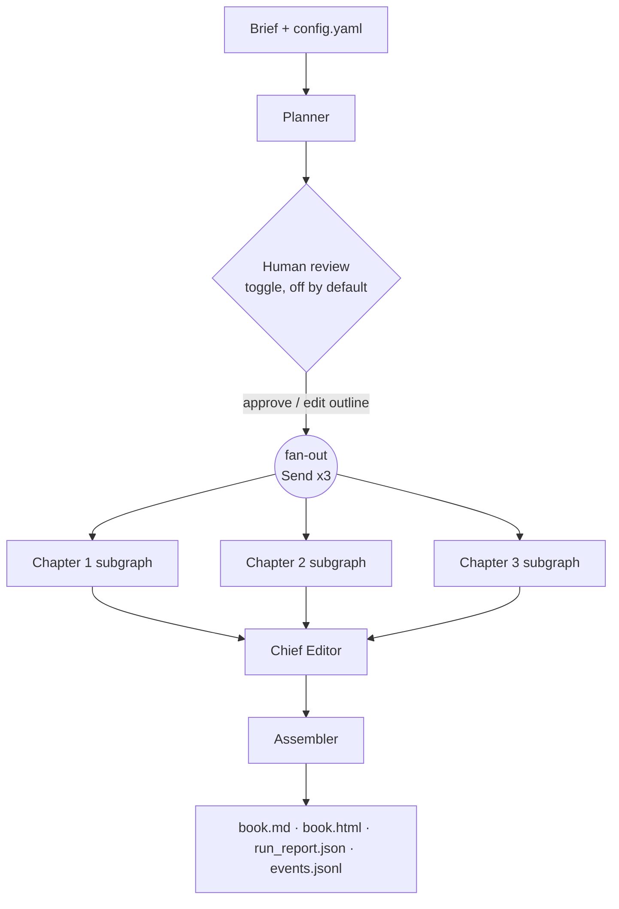
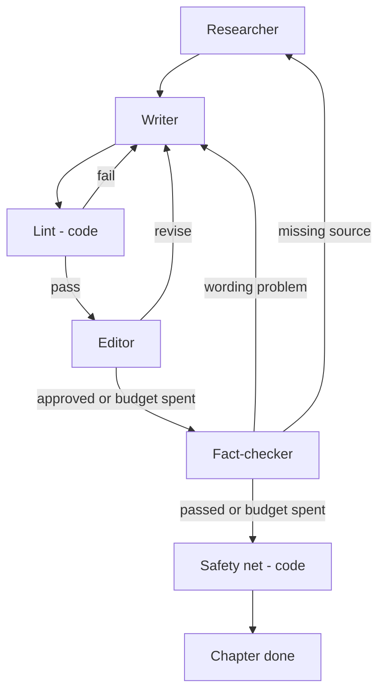

# Implementation Plan: Multi-Agent Book Writer

> **Status: approved on Saturday 3 October 2026.** Implementation starts in the next session.
> History: v1 drafted with Opus 5.5; reviewed and revised by Fable 5.1 (section 0 records what changed and why); approved by Shikhar.
> Assignment: Patel Group, AI Engineer take-home. **Deadline: Monday 5 October 2026, 12:00 IST.**

---

## 0. Review notes: what changed from v1, and why

**v1's architecture is sound and the code written so far matches it.** Typed blackboard state, code routers, deterministic lint before LLM review, verified-evidence-only writing, bounded loops, and the research MCP server are all the right calls for this brief. Nothing in v1 is thrown away.

The changes fall into three groups: **corrections** (things that were wrong or unspecified), **scope discipline** (the deadline is 45 hours away), and **design upgrades** (small additions with a large payoff in the interview).

| # | Change | Why |
|---|---|---|
| 1 | **Cost accounting corrected.** Prices become per model with separate input, output, cache-read and cache-write rates, live in `config.yaml` next to the model IDs, and are shared by the runtime and the dev-cost script through one `pricing.py`. Events also carry cache-write tokens. | Verified against the API reference: Opus 5.5 cache reads are **0.05×** input price, not the 0.1× the code assumes, so v1 overstates Researcher-style cached calls on Opus 2×. Unknown model IDs silently price at $0 (this Fable 5.1 review session reads as $0 in `DEV_COST.md`). The cost story is your showcase; it has to be right. |
| 2 | **Effort policy.** Writer: `medium` on the first pass, `high` on revision passes. Editor: `medium`. Planner, Fact-checker, Chief Editor stay `high`. Every effort is set explicitly. | Anthropic's published effort curves for research and knowledge work are nearly flat between `medium` and `high`; "run cheap, re-run failures at higher effort" held quality at about half the cost in their runs. Opus 5.5's default effort is `medium`, so leaving it implicit would be a silent choice. |
| 3 | **Model routing unchanged, now justified and measured.** Strong (Opus 5.5) for Planner, Writer, Fact-checker, Chief Editor; balanced (Sonnet 5.5) for Researcher and Editor; fast (Haiku 4.5) for claim tagging. | Each agent call is its own conversation, so per-role routing has no prompt-cache penalty. Citation accuracy is the heaviest-weighted criterion, so the Fact-checker's judge stays on the strongest model. Run 1 records cost per agent; the README then shows measured, not guessed, numbers. |
| 4 | **Fetch resilience.** Tavily Extract fallback also fires on 403/406/429 anti-bot responses, not only on JavaScript shells. A link counts as working if the page was readable by either route. | RBI and NPCI are the brief's preferred sources and the most likely to block a plain HTTP client. Without this, the system would systematically drop official sources in favour of news. |
| 5 | **Editor budget exhaustion defined.** | v1 defined only fact-check exhaustion. |
| 6 | **Replay mode.** Every run records its event stream; `bookwriter replay <run>` feeds a recording to the dashboard over the same SSE endpoint. | The dashboard is built, demoed and screenshotted at $0 and without Tavily or API flakiness. Frontend work no longer waits on a perfect backend. |
| 7 | **The architecture diagram and the dashboard's agent graph are generated from the LangGraph graph itself** (`GET /graph`, Mermaid export in `docs/`). | One source of truth; the diagram cannot drift from the code. A strong interview point. |
| 8 | **Dashboard trimmed to 5 screens** (from 9). Design system documented in `DESIGN.md` plus a tokens file; a `/design` page only if time remains. | Fewer excellent screens beat many mediocre ones. The frontend is the largest schedule risk. |
| 9 | **Moved to stretch:** `bookwriter-mcp` server, Docker, resume-after-crash UI. | Docker isn't installed here; an untested Dockerfile in a job application is worse than none. The second MCP server is a thin wrapper over REST and adds little the research server doesn't already prove. |
| 10 | **"Always submittable" schedule.** Saturday night: CLI run + README + sample book pushed. Every later milestone adds; none may break the pushed state. | The "Working result" criterion is binary. We are never in a state where nothing can be submitted. |
| 11 | **Repo hygiene before the first commit.** `.gitignore`, rename `master` → `main`, `.env.example`, the `.docx` stays out of the repo, plan moves to `docs/`, `pyproject.toml` placeholders fixed, real CLI entry point. | Evaluators check how the project is scaffolded and how clean the directory is. Right now `.venv/` and `data/` would be committed and `bookwriter` prints "Hello from bookwriter!". |
| 12 | **Researcher coverage → Writer.** The Writer is told which fact needs have no evidence and must be written around. | Prevents the Writer from guessing at facts the Researcher couldn't source. Five lines. |
| 13 | **`parallel_chapters` knob** (default 3; set to 1 if the account's rate limits bite). | A fresh API account may sit on a low rate-limit tier. Cache reads don't count toward input-token limits, which helps the Researcher loop, but three Opus writers in parallel might still hit 429s. |
| 14 | **CI validates the committed sample book** against the brief's rules via the scorecard. | The repo proves, on every push, that its own output follows the brief. |

---

## 1. Goal and principles

Build a **production-style multi-agent system** that researches and writes the three-chapter book
*"Pay Me on UPI: How Digital Payments Changed Small Business in India"* with real, verified citations, ships with a live dashboard, and demonstrates multi-agent design, agentic tool use via MCP, backend and frontend craft, and token and cost discipline.

Principles the design follows, in priority order:

1. **The brief first.** A small system that works beats a complex one that doesn't. Tiered milestones; a working book before any polish.
2. **Code enforces what code can.** Word counts, format, citation syntax, quote verification and link checks are deterministic. LLMs spend their attention on judgement.
3. **Every hand-off is typed.** Agents read and write Pydantic models on a shared state; routers are plain Python. No free-form agent chatter.
4. **Nothing unverified reaches the page.** The Writer never sees a URL; every reference comes from a page the Researcher fetched and a quote code found on it.
5. **Bounded loops.** Every reviewer has a round budget; every tool loop has a call budget; exhaustion has a defined outcome.
6. **Measure cost, don't guess.** Every call is metered; the README reports measured numbers from a real run.

---

## 2. Brief compliance checklist

| # | Requirement from the brief | How the system guarantees it |
|---|---|---|
| 1 | Agents: Planner, Researcher, Writer, Editor, Fact-checker | Six agents (adds a Chief Editor), each a node in the graph |
| 2 | 3 chapters, about 600-900 words each | Planner fixes 3 chapters; lint counts words and sends the chapter back if outside range |
| 3 | Every fact, figure and date has a numbered citation `[1]` | Writer cites evidence ids; lint flags any sentence with a digit and no citation; a Haiku claim tagger flags uncited factual sentences without digits |
| 4 | Each chapter ends with a reference list: source name, title, working link | Assembler builds it from verified evidence, one entry per source page; titles cleaned of site suffixes |
| 5 | Sources real and publicly accessible; prefer NPCI, RBI, government, then reputable news | Writer never sees or writes URLs. Every link comes from a page the Researcher fetched. Domain allow and block lists; official-first search; official-source share in the scorecard |
| 6 | No invented or broken sources | Quote verified in code against the fetched page; link check before publishing; LLM support check against the quote and page context; safety net removes anything still unverified |
| 7 | Friendly mentor tone, plain English, jargon explained the first time | Style guide and glossary from the Planner; the glossary assigns each term to the chapter that explains it; the Editor reviews against it |
| 8 | Same voice across all chapters | Shared style guide plus a Chief Editor whole-book pass |
| 9 | Clean grammar and spelling | Editor loop with a structured verdict; must-fix issues block approval |
| 10 | Flowing prose, no bullet points in chapters | Writer outputs a paragraph array; lint rejects list markers, headings, bold and URLs |
| 11 | One line starting `Takeaway:`, before the reference list | Separate `takeaway` field validated by code; the renderer places it before the references |
| 12 | Submit: GitHub repo + README, architecture diagram, screenshots | Section 14 |

---

## 3. Architecture



Five layers:

1. **Agent engine:** LangGraph state machine (sections 4 and 5).
2. **MCP layer:** our research MCP server; agents get their web tools through MCP (section 7).
3. **API service:** FastAPI with live streaming, replay, persistence and human-in-the-loop (section 9).
4. **Dashboard:** Next.js + TypeScript + Tailwind + shadcn/ui + React Flow, with a small design system (section 10).
5. **Quality and ops:** tests, CI, self-grading scorecard, token and cost accounting (sections 8 and 11).

---

## 4. Agent graph

### 4.1 Top level



- **Human review** uses LangGraph `interrupt()`. Off by default. When on, the run pauses after the Planner and the dashboard shows the outline for approval or edits.
- **Fan-out** uses LangGraph `Send`: chapters are researched and written in parallel, bounded by `parallel_chapters`.

### 4.2 Chapter subgraph



Order rationale: the cheap reviewer (Editor, Sonnet) stabilises the text before the expensive one (Fact-checker, Opus plus link checks) runs. A fact-check-driven revision goes back through lint and the fact-check only; the Chief Editor covers tone on the final text.

### 4.3 Collaboration contract: who writes what

Agents never talk to each other directly. They read and write named keys on a typed chapter state; routers read the results and pick the next node.

| State key | Written by | Read by |
|---|---|---|
| `plan`, `outline` | Planner (via fan-out) | Researcher, Writer, Editor, Chief Editor |
| `evidence[]` | Researcher | Writer, Fact-checker, Assembler |
| `coverage` (fact needs with no evidence) | Researcher | Writer |
| `draft` | Writer | Lint, Editor, Fact-checker, Chief Editor |
| `lint_issues[]` | Lint | Router → Writer feedback |
| `editor_verdict` | Editor | Router → Writer feedback, scorecard |
| `fact_report` | Fact-checker | Router → Writer or Researcher feedback, safety net, scorecard |
| `feedback` (`{from, items[]}`) | Routers | Writer |
| `gaps[]` | Router (from fact report) | Researcher |
| `removed_sentences[]` | Safety net | Scorecard, report |
| counters: `writer_passes`, `lint_rounds`, `editor_rounds`, `fact_check_rounds` | Routers | Routers (stop conditions) |
| `log[]` | Every node | Report, dashboard |

### 4.4 Stop conditions

| Loop | Budget (`config.yaml`) | When exhausted |
|---|---|---|
| Lint → Writer | 3 rounds | Proceed to Editor with remaining lint issues attached as should-fix feedback; logged |
| Editor → Writer | 2 rounds | Proceed to Fact-checker; `editor_approved=false` recorded; scorecard shows it |
| Fact-checker → Writer / Researcher | 2 rounds | Safety net runs |
| Total Writer passes per chapter | 7 | Hard stop; safety net runs |
| Researcher tool calls | 40 initial, 15 per gap round | The loop ends; the Writer works with what was found |

**Safety net (code):** any sentence still UNSUPPORTED, PARTIAL, or UNCITED-with-a-figure is removed. The chapter is re-linted for length only. If it falls below 600 words the run still completes, but the scorecard marks the chapter **"shipped with warnings"** and the report lists every removal. We never ship an unverified fact and we never fail silently.

---

## 5. Agents, model routing and effort

| Agent | Tier · effort | Input | Output | Guardrails |
|---|---|---|---|---|
| **Planner** | strong · high | Brief | `Outline`: 3 chapter plans (goal, arc, key points, 5-7 fact needs as questions, takeaway idea) + `StyleGuide` (persona, voice, do/don't, glossary with "introduced in chapter N", sample paragraph) | Prompt forbids facts in the outline; code enforces 3 chapters, ids, glossary de-duplication |
| **Researcher** | balanced · medium, agentic tool loop | Chapter plan + fact needs | `Evidence[]` + `coverage` | Tools via MCP. `record_evidence` rejects URLs not read this session and quotes not found verbatim on the page; official sources first; blocked domains; evidence cap |
| **Writer** | strong · **medium first pass, high on revisions** | Plan, style guide, glossary split, evidence pack (ids, claims, quotes; no URLs), coverage gaps | `ChapterDraft`: title, paragraphs[], takeaway | May cite only pack ids; amounts in examples in words; revisions get the previous draft plus exact feedback |
| **Lint** | code | Draft | Issues | Word count, no lists/headings/URLs, citation format and placement, unknown ids, ≥3 sources, digits need citations, takeaway rules |
| **Editor** | balanced · **medium** | Draft + style guide | `EditorVerdict`: approved, 6 scores, issues (quote, problem, fix, severity) | Code re-checks approval: no must-fix and all scores ≥ 4. May not touch citations or ask for facts |
| **Claim tagger** | fast | Numbered sentences | Factual-claim flag per sentence | Narrow classification only |
| **Fact-checker** | strong · high, plus code | Draft + evidence | `FactCheckReport`: per-sentence SUPPORTED / PARTIAL / UNSUPPORTED / UNCITED, link statuses | Layer 1 links (code), layer 2 coverage (Haiku), layer 3 support judged only against the verified quote and page context |
| **Chief Editor** | strong · high | All 3 chapters | Consistency notes + find/replace edits | Code applies an edit only if the text is unique and citations, figures and lint are unchanged |
| **Assembler** | code | Final drafts + evidence | `[1]..[n]` per chapter, reference lists, MD and HTML | Same URL gives the same reference number |

**Why this routing, in one paragraph for the interview.** Judgement that the grade depends on (planning the book, writing the prose, deciding whether a sentence is supported, harmonising the voice) runs on the strongest model. Work that is high-volume or tool-heavy but checkable (research loop, editorial review) runs one tier down, where the loop's growing history is served from the prompt cache. Pure classification runs on the fastest model. Each call is a fresh conversation, so routing per role costs nothing in cache misses. Effort is explicit everywhere; the Writer starts at `medium` and only pays for `high` when a reviewer sends the chapter back.

**What we deliberately did not do.** No prompt caching on single-shot calls: a 3k-token system prompt reused twice saves about a cent; the Researcher loop is where caching pays and that is where it is on. No Haiku for anything requiring judgement. No model switching inside a conversation. No second cheaper "advisor" layer; the published results show it buys roughly what higher effort buys.

Routing, effort and prices live in `config.yaml`. The provider and models can be swapped without code changes, and swapping a model ID to one without a price entry fails loudly instead of reporting $0.

---

## 6. Citation integrity

1. **Search** through Tavily, official domains first.
2. **The page is fetched** and its text extracted: HTML via trafilatura, PDF via pypdf. **Tavily Extract is the fallback for JavaScript shells and for 403/406/429 anti-bot responses.** Pages are cached on disk; pages without readable text are never cached as valid.
3. **The quote is verified in code**: verbatim after normalisation, or a contiguous match covering ≥ 85% of the quote.
4. **The Writer cites ids, not URLs.** URLs enter the book only through the Assembler, from verified evidence.
5. **The Fact-checker re-checks links** and judges claim support against the stored quote and context. A link is "working" if HTTP < 400 **or** the page was readable through the extract route (official sites that block bots but render for humans).
6. **Reference titles are cleaned** of site suffixes (" | Reuters", " - PIB") so each entry reads as source name, title, link.
7. **The safety net** removes unverified sentences when budgets run out.

Known risk from the spike: `npci.org.in` is JavaScript-rendered. Mitigations: Tavily Extract; PIB press releases and RBI and NPCI PDFs are readable; such pages are never cached as valid.

---

## 7. MCP layer

| Server | Tools | Used by | Status |
|---|---|---|---|
| **research-mcp** | `web_search(query, official_only)`, `read_page(url, focus)`, `verify_quote(url, quote)`, `check_links(urls)` | Researcher and Fact-checker (stdio subprocess), Claude Desktop, Claude Code | **Built and tested** over stdio and in-process |
| **bookwriter-mcp** | `start_book_run`, `get_run_status`, `get_book`, `get_run_cost` | Any MCP host | **Stretch** (section 13) |

- Agents use one abstraction, `ToolSpec`, so MCP tools and local tools such as `record_evidence` mix in the same loop.
- The README includes a ready-to-paste `claude_desktop_config.json` / `.mcp.json` snippet so an evaluator can call the research tools from Claude Desktop.

---

## 8. Token and cost accounting

### 8.1 Runtime: every run is metered
- Every LLM call emits an `llm_call` event: model, input, output, **cache-read and cache-write** tokens, cost in USD, latency, stop reason.
- Rolled up per run, per agent, per chapter and per model; stored in SQLite; shown live in the dashboard and in `run_report.json`.
- **Pre-run estimate:** median of previous runs once history exists; a static model before that.
- **Budget guard:** optional `max_cost_usd` per run; the run stops gracefully at the cap.
- Tavily credits counted per run.

### 8.2 Prices (verified against the API reference, USD per 1M tokens)

| Model | Input | Output | Cache read | Cache write (5 min) |
|---|---|---|---|---|
| `claude-opus-5-5` | 4.00 | 20.00 | **0.20 (0.05×)** | 5.00 (1.25×) |
| `claude-sonnet-5-5` | 2.00 | 10.00 | 0.20 (0.1×) | 2.50 (1.25×) |
| `claude-haiku-4-5` | 1.00 | 5.00 | 0.10 (0.1×) | 1.25 (1.25×) |
| `claude-fable-5-1` (dev sessions only) | 10.00 | 50.00 | 0.25 (0.025×) | 12.50 (1.25×) |

These go into `config.yaml` under `models`, and a single `pricing.py` prices both runtime events and the dev-cost report.

### 8.3 Estimated cost per book run (replaced by measured numbers after run 1)

| Agent | Calls | Rough cost |
|---|---|---|
| Planner (Opus) | 1 | ~$0.10 |
| Researcher (Sonnet loop, cached) ×3 | ~25 turns each | ~$1.20 |
| Writer (Opus) ×3 | ~2-3 passes each | ~$1.00 |
| Editor (Sonnet) ×3 | ~2 each | ~$0.15 |
| Claim tagger (Haiku) | ~6 | ~$0.03 |
| Fact-checker (Opus, high) ×3 | ~2 each | ~$0.60-1.20 |
| Chief Editor (Opus) | 1 | ~$0.15 |
| **Total** | | **≈ $3.5-5 per book**, plus ~60-100 Tavily credits (free tier: 1,000/month) |

### 8.3a Keeping development spend low

Approved direction: this is an assignment, not a product, so API spend stays minimal.

**The two profiles are not two designs.** `showcase` *is* the system: Opus for judgement, Sonnet for the research loop and editing, Haiku for tagging, exactly as section 5 describes. It produces the submitted book and is what the README documents. `dev` exists only while building: it runs the same graph, same prompts, same routers and same checks on Sonnet so that bugs in plumbing (loops that don't stop, a router that picks the wrong edge, a prompt placeholder left empty) surface at a fifth of the price. Model quality is irrelevant to those bugs. Once the pipeline runs clean on `dev`, one `showcase` run produces the book that ships.

- **Two routing profiles in `config.yaml`:** `showcase` (the table in section 5; used for the submitted run) and `dev` (Sonnet 5.5 for every judgement role at `low`/`medium` effort, Haiku for tagging). A full `dev` run costs roughly $1.5-2. The dashboard's New run form and `bookwriter run --profile dev` select it.
- **Single-chapter debug runs:** `bookwriter run --chapters 1` exercises the whole chapter loop at a third of the cost (about $0.60 on `dev`).
- **No API spend for the frontend or tests:** the fake-LLM end-to-end test and replay mode cover both.
- **Default per-run cost cap:** `max_cost_usd: 5`.
- **Planned spend:** 3 single-chapter `dev` runs (~$2) + 1 full `dev` run (~$2) + 1 full `showcase` run (~$4-5) ≈ **$8-9. About $10 of API credit covers it.** If even that is too much, the submitted run can use `dev` routing as well (≈ $2 extra in total), at the cost of the "strong models for judgement" story in the README.

### 8.4 How we minimise tokens (to say out loud in the interview)

| Technique | Where |
|---|---|
| Right-sized models per role, explicit effort, cheaper effort on first drafts | `config.yaml` roles |
| Prompt caching of the growing tool-loop history (cache reads also don't count toward input-token rate limits) | Researcher loop |
| Deterministic code checks before any LLM review | Lint node |
| Compact tool outputs: top-ranked passages (≤ 9k chars), not whole pages | `read_page` |
| The Writer sees only what it needs: ids, claims, quotes | Writer prompt |
| Bounded loops and tool budgets | `limits` |
| Disk page cache: re-runs don't refetch | `data/cache` |
| One batched fact-check call per chapter | Fact-checker |
| Replay mode: dashboard development and demos cost $0 | `bookwriter replay` |

### 8.5 Development cost (building this project)
- `scripts/dev_usage.py` reads the Claude Code transcripts for this project and writes `docs/DEV_COST.md`: calls, peak context, cumulative tokens by kind, API-list-price equivalent, **broken down by session and by model** so the story reads "planning, build, review".
- Fixes: add Fable 5.1 pricing (this review session), per-model cache-read rates, shared `pricing.py`.
- Regenerated at each milestone; the final numbers go in the README. Actual charge is $0 (Max plan); the report says so.

---

## 9. Backend service (FastAPI)

| Endpoint | Purpose |
|---|---|
| `POST /runs` | Start a run (brief, model and limit overrides, HITL toggle, cost cap). Returns `run_id` |
| `GET /runs` · `GET /runs/{id}` | History, status, summary, cost |
| `GET /runs/{id}/events` | **SSE** live stream with replay from any offset (a refreshed page catches up) |
| `POST /runs/{id}/resume` | Resume a paused HITL run with an approved or edited outline |
| `GET /runs/{id}/book.{md,html}` · `GET /runs/{id}/report` | Outputs + scorecard |
| `GET /graph` | The agent graph exported from LangGraph (nodes, edges) for the dashboard and the diagram |
| `GET /estimate` · `GET /config` | Pre-run estimate; default brief and routing for the form |

- **Persistence:** SQLite (runs, events) plus the LangGraph `AsyncSqliteSaver` checkpointer. Checkpointing is on; a resume-after-crash UI is stretch.
- **Files per run:** `data/runs/{run_id}/events.jsonl`, `book.md`, `book.html`, `run_report.json`. Page cache in `data/cache/pages/`. `data/` is git-ignored.
- **CLI (Typer):** `bookwriter run [--profile dev|showcase] [--chapters N]` (headless, live terminal view via `rich`), `bookwriter serve`, `bookwriter replay <run_id>`, `bookwriter mcp research`, `bookwriter graph` (prints Mermaid).
- **Resilience:** SDK retries with backoff (429, 5xx), timeouts, tool errors returned to the model, refusal and max-token handling, `parallel_chapters` knob.

---

## 10. Dashboard and design system

**Stack:** Next.js (App Router, client components) + TypeScript + Tailwind + shadcn/ui + React Flow + Recharts.

| Screen | Contents |
|---|---|
| **Runs** | Run history (status, cost, quality) and a **New run** drawer: pre-filled brief, model routing per agent, limits, HITL toggle, cost cap, estimated cost |
| **Live run** | **Agent graph** from `GET /graph` where nodes light up as agents work and loop-backs animate; 3 chapter lanes with round counters; live activity feed ("Editor sent Ch.2 back: 3 must-fix"); **token and cost ticker**. Outline review (HITL) appears here as a modal when enabled |
| **Book** | Reader with book typography (serif); hover a `[3]` to see source, verified quote and fact-check badge; evidence side panel (official/news tag, link status, which sentences cite it); download MD or HTML |
| **Report** | **Scorecard**: the system grades itself against the brief (word counts, citation coverage, % claims supported, links working, official-source share, bullets, takeaways, editor scores, revision rounds, warnings). **Cost** tab: per agent, model and chapter; cache-hit rate; cost per book |
| **Design** (only if time) | Tokens, components, agent colours. Otherwise `DESIGN.md` documents the system |

**Design system:** CSS-variable tokens (colour, type scale, spacing, radius, shadow, motion), light and dark mode, shadcn components themed from the tokens, a fixed **identity colour and icon per agent** used consistently in graph, feed, badges and charts. Inter for the dashboard; a serif (Source Serif or Literata) for the book.

---

## 11. Quality and engineering

- **Tests (pytest):** lint rules; citation renumbering and references; Chief Editor edit guards; routers (loop and stop logic, budget exhaustion); quote verification; fetch fallback; MCP server tools (in-process); **end-to-end graph run with a fake LLM** (no API cost); **the committed sample book passes the scorecard**.
- **CI (GitHub Actions):** ruff + pytest + frontend type-check and build, from the first push onward.
- **Config:** `.env.example` (keys) and `config.yaml` (brief, models, prices, limits, domains).
- **Docs:** README (quick start in five commands, architecture, agent design, citation pipeline, cost story, MCP demo, screenshots), `docs/` with the generated diagram, `DEV_COST.md`, `DESIGN.md`, sample output.

---

## 12. Repository hygiene and git workflow

Done on 3 October (the folder is ready for its first commit):
- Root `.gitignore` (`.venv/`, `backend/data/`, `.env`, `__pycache__/`, `node_modules/`, `.next/`, `out/`, the assignment document).
- Branch renamed `master` → `main` (no commits yet; the first commit is the scaffold, made at the start of the next session).
- `backend/.env.example` plus an empty `backend/.env` to fill in; `pyproject.toml` description, ruff and pytest config; the hello-world entry point removed (the `bookwriter` script returns together with `cli.py` in M1).
- The assignment `.docx` lives in `docs/assignment/`, git-ignored (it is the company's document; the brief's content lives in `config.yaml`). Plan at `docs/PLAN.md`; README stub at the root.

Workflow: one commit per feature with conventional messages (`feat(engine): chapter subgraph and routers`). Pushed state is always runnable. Milestone tags `m1-engine` … `m5-ship`.

Final layout:

```
Patel Group/
├── README.md  ·  .gitignore  ·  .github/workflows/ci.yml
├── backend/
│   ├── config.yaml  ·  .env.example  ·  pyproject.toml  ·  uv.lock
│   ├── src/bookwriter/
│   │   ├── config.py  models.py  state.py  events.py  llm.py  pricing.py  render.py
│   │   ├── graph.py  routers.py  runner.py  store.py  estimate.py  scorecard.py  cli.py
│   │   ├── agents/  prompts/  checks/  tools/  mcp_servers/  mcp_client.py  api/
│   └── tests/
├── frontend/                     Next.js dashboard  (+ DESIGN.md)
├── scripts/dev_usage.py
└── docs/   PLAN.md  architecture.md (generated Mermaid)  DEV_COST.md  screenshots/  sample-output/
```

---

## 13. Schedule: always submittable

| # | Milestone | Done when | Target |
|---|---|---|---|
| M1 | **Core engine** | `graph.py`, `routers.py`, `runner.py`, pricing fix, fetch fallback, scorecard; `bookwriter run` produces a book that passes the scorecard; events recorded | **Sat 3 Oct night** |
| M1.5 | **First push** | `.gitignore`, `main`, README quick start, sample book, CI. **Submittable from here on** | Sat night, right after M1 |
| M2 | **Service** | FastAPI, SSE + replay, store, HITL, `GET /graph`, estimate | Sun 4 Oct midday |
| M3 | **Dashboard** | Design tokens, Runs, Live run, Book, Report; built against replay | Sun 4 Oct evening |
| M4 | **Polish** | Tests complete, DEV_COST regenerated, generated diagram, screenshots via the built-in browser | Sun 4 Oct night |
| M5 | **Ship** | Final clean run committed to `docs/sample-output/`, README final, Google Form + email | **Mon 5 Oct morning, before 12:00 IST** |
| Stretch | Only after M5 is ready | `bookwriter-mcp`; `/design` page; Docker (only if Docker Desktop is installed and the image is tested); resume-after-crash UI; Writer-initiated fact requests to the Researcher | |

Targets assume the next session starts Saturday evening. If it starts Sunday morning, M2 to M4 compress into Sunday and the stretch list is skipped entirely.

Cut order if time is short: stretch first, then the Report's cost tab (numbers still in `run_report.json`), then HITL. M1, M1.5 and M5 are never cut.

---

## 14. Submission deliverables

- [ ] Public GitHub repo with README (how to run, architecture, agent design, cost story)
- [ ] Architecture diagram: generated Mermaid in README and `docs/`, plus a PNG export
- [ ] Screenshots: dashboard live run, terminal run, book reader
- [ ] Generated book committed as `docs/sample-output/book.md`, `book.html`, `run_report.json`, `events.jsonl`
- [ ] `docs/DEV_COST.md` with final numbers, summarised in the README
- [ ] Submit via the Google Form **and** email (the brief mentions both)

---

## 15. Current status

*Updated Saturday 3 October 2026, evening.*

**M1 (core engine) and M1.5 (first push) are done.**
- Book graph with `Send` fan-out and the chapter subgraph; plain-Python routers with every stop condition in section 4.4; code safety net; runner recording `events.jsonl` and `run_report.json`; scorecard; `bookwriter run | report | graph | mcp`.
- `pricing.py` shared by the runtime and `scripts/dev_usage.py`, prices in `config.yaml`; `showcase` and `dev` routing profiles; per-run cost cap.
- Tavily Extract fallback on 403/406/429; links count as working through either route; reference titles cleaned.
- 69 tests, including a fake-LLM end-to-end run that drives every loop, the scorecard on the committed sample book, and a check that the README diagram matches the graph. CI on every push.
- README with quick start, generated agent graph, citation pipeline, measured costs and MCP setup.

**Measured, not estimated (section 8.3):** four `dev` runs cost $3.42 in total. The full three-chapter `dev` book took 5 minutes and $1.61 (Researcher $0.62, Writer $0.50, Editor $0.19, Fact-checker $0.18, Planner, tagger and Chief Editor $0.12 together). The three single-chapter runs before it found and fixed lint false positives on names like "UPI123Pay", a sentence splitter that broke on "Dr.", claims that said more than their quotes, and Editor rules that contradicted the Writer's. The sample book in `docs/sample-output/` is from the full `dev` run.

**Showcase run (the submitted book):** $2.93 in 8 minutes, under the $3-4 estimate: Writer $1.40, Researcher $0.65, Fact-checker $0.34, Editor $0.22, Planner $0.17, Chief Editor $0.09, tagger $0.05. Scorecard passed; 29 of 29 claims supported; chapters 2 and 3 shipped with the Editor's last style notes unapplied. It replaced the `dev` book in `docs/sample-output/`. Total API spend so far: $6.35.

**M2 (service) is done.** FastAPI app (`bookwriter serve`) with every endpoint in section 9: runs, a resumable SSE event stream, outline review (LangGraph `interrupt()` with SQLite checkpoints), cancel, outputs, `GET /graph` exported from LangGraph, config and a pre-run estimate (median of measured runs, a prior before any history). `bookwriter replay` replays a recording in the terminal; `?speed=N` on the event stream replays it for the dashboard. 80 tests, including the API end to end with the fake LLM.

One deliberate change from section 9: runs and events are not copied into SQLite tables. A run is its folder (`events.jsonl`, `run_report.json`, the book), which the CLI, the API and the committed sample already share; a second copy in a database would be a second source of truth to keep in step. SQLite holds only the LangGraph checkpoints. The runs list is read from the folders; live runs are served from memory.

**Next:** M3 (dashboard), built against recorded runs.

---

## 16. Inputs and their status

1. **Plan:** approved on 3 October.
2. **API keys in `backend/.env`:** in place since 3 October (never pasted in chat).
   - `ANTHROPIC_API_KEY` from console.anthropic.com with **about $10 of credit** (section 8.3a). The Max plan covers Claude Code, not API calls. If runs hit 429s, set `parallel_chapters: 1`.
   - `TAVILY_API_KEY`, free at tavily.com.
   Nothing in M1 can be validated without these; they are the critical path for the next session.
3. **GitHub:** username `shikharsumantech14`, repository **`book-writer`** (public). Shikhar creates it and does every push; commits are made locally with plain messages and no AI attribution.
4. **Docker:** not installed; stays out unless Docker Desktop is installed before M4.

## 17. Decisions (approved defaults in bold)

| Decision | Options |
|---|---|
| Development spend | **About $10 total: `dev` profile for debugging, single-chapter runs, one `showcase` run** (section 8.3a) |
| Writer model | **Opus 5.5 in `showcase`, Sonnet 5.5 in `dev`** (prose quality is graded directly; the `dev` run doubles as the cheap comparison for the README) |
| Fact-checker effort | **high** / xhigh (correctness over cost; roughly doubles its ~$1 share) |
| HITL default | **Off** (toggle in the UI) / on |
| Per-run cost cap default | **$5** / other |
| Search provider | **Tavily** / Claude's built-in web search (one key fewer, weaker MCP story) |
| Book export | **Markdown + HTML** (PDF via browser print) / native PDF |
| Chapter parallelism | **3 in parallel** / sequential (simpler event timeline, slower) |
