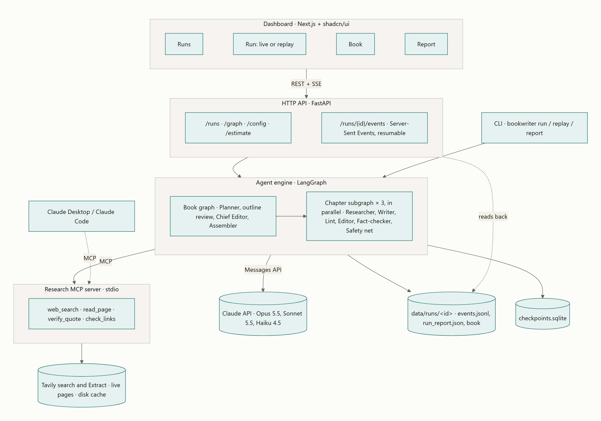
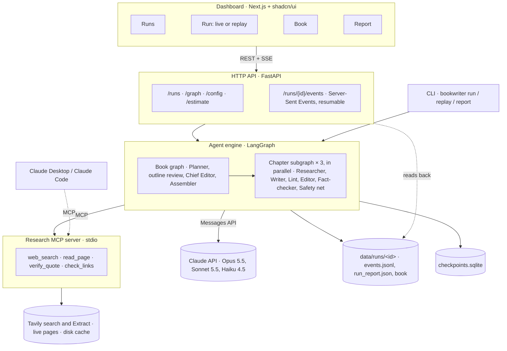
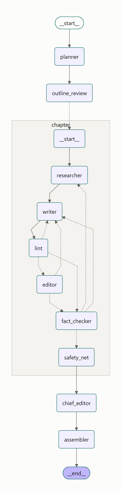
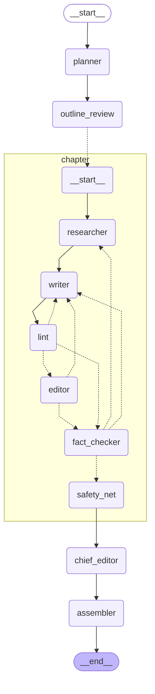

# Architecture

## System

<!-- system-diagram:start -->

<!-- system-diagram:end -->

| Layer | Code | What it does |
|---|---|---|
| Agent engine | `backend/src/bookwriter/graph.py`, `routers.py`, `agents/` | Runs the agents as a LangGraph state machine. Agents read and write typed state; plain-Python routers choose the next step |
| Research MCP server | `mcp_servers/research.py`, `tools/web.py` | Search, page reading with fallback, quote verification and link checks, served over MCP to the Researcher, the Fact-checker and any MCP host |
| LLM layer | `llm.py`, `pricing.py` | The one place that calls Claude: routing per role, structured outputs, the tool loop, prompt caching, metering and the cost cap |
| Runner and store | `runner.py`, `store.py`, `events.py` | Runs a book, records every event, writes the report; a run is its folder |
| HTTP API | `api/app.py`, `api/runs.py` | Starts, follows, reviews and cancels runs; streams events; serves outputs, the graph, config and estimates |
| Dashboard | `frontend/` | Runs, live run and replay, book reader, report |

## Agent graph

Generated from the compiled LangGraph graph (`uv run bookwriter graph`); a test fails if it drifts from the code.

<!-- agent-graph:start -->

<!-- agent-graph:end -->

## What happens in a run

1. **Plan.** The Planner turns the brief into an outline: three chapters, five to seven fact questions each, a style
   guide and a glossary. With review switched on, the run pauses here until a person approves or edits it.
2. **Fan out.** One chapter subgraph per chapter starts, all in parallel (`run.parallel_chapters`).
3. **Research.** The Researcher searches (official sources first), reads pages and records evidence. Code accepts a
   quote only if it appears on the page, and a claim only if every number in it is in the quote.
4. **Write and review.** The Writer drafts from the evidence ids; lint (code) checks the rules code can check; the
   Editor reviews language; the Fact-checker checks links, then whether each cited quote supports its sentence.
   Each can send the chapter back, within its budget; a missing source sends it back to the Researcher.
5. **Safety net.** When the budgets run out, code removes anything still unverified.
6. **Harmonise and assemble.** The Chief Editor proposes guarded edits for one voice across chapters; the
   Assembler numbers citations and builds the reference lists; the scorecard grades the book against the brief.

Every step is an event in `events.jsonl`. The CLI prints them, the API streams them, the dashboard draws them, and
replay plays them back.
